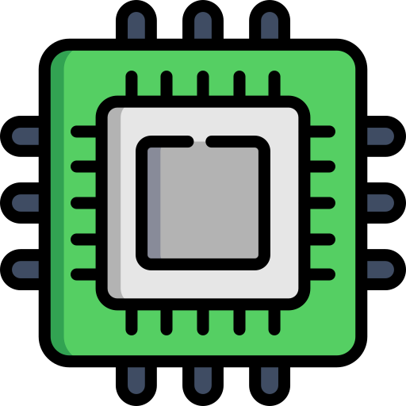

DigiKey 3D Training Environment

<h2>Client</h2> 
Contract: Subvrsive
 
<b>for DigiKey</b>
 <!-- PROJECT LOGO -->   
  <h3 align="center">DigiKey 3D Training Environment</h3> 
 Immersive 3D web-based training environment with product interactions, CMS integration, and seamless connection with DigiKey’s 2D website. 
 
 <!-- ABOUT THE PROJECT -->
About The Project

 This project was created for <b>DigiKey</b>, one of the world’s leading electronic components distributors. The goal was to design an interactive 3D training environment that blends product visualization, warehouse simulation, and a learning journey through DigiKey’s ecosystem.
The experience allows users to navigate through a virtual DigiKey facility, interact with products in 3D, access technical details via CMS, and link directly to DigiKey’s website for datasheets and purchasing.

 <h3>Main Features</h3>
3D Model Visualization – Explore and rotate detailed product models in a virtual training setting.
CMS Integration – Dynamic product data connected with DigiKey’s content systems.
3D Interactions – Interactive hotspots and training touchpoints for user engagement.
2D Website Connection – Direct links to datasheets and product pages within DigiKey’s site.
Training Environment – Simulated warehouse and test benches replicating DigiKey’s operations.
<h3>Challenges</h3> 
 One of the main challenges of the DigiKey training environment was balancing technical accuracy with performance. The system needed to display multiple interactive 3D models while maintaining fast load times and responsive user interaction.
I worked on integrating CMS-driven data with the 3D space, ensuring smooth communication between the virtual environment and DigiKey’s product pages. Another challenge was creating intuitive interaction flows that would allow users to transition from immersive 3D experiences to technical product information seamlessly.

<section id="tech-stack">
  <h2>Tech Stack</h2>
  <ul>
    <li><strong>React</strong> – application framework, UI logic, state management (zustand)</li>
    <li><strong>react-babylonjs </strong> – declarative layer over babylon for 3D scenes</li>
    <li><strong>babylon.js</strong> – rendering, materials, lighting, model loaders</li>
    <li><strong>tween.js</strong> – smooth camera moves, hotspot reveals, UI–3D transitions</li>
    <li><strong>Custom CMS Integration</strong> – authoring schema so DigiKey staff could add/update products, hotspots, and text, automatically syncing with the 3D environment</li>
    <li><strong>Git/GitHub</strong> – feature branches, PR reviews, release tags</li>
    <li><strong>Build Tools</strong> – Vite bundler, DRACO mesh compression</li>
    <li><strong>Deployment</strong> – hosted on <strong>Azure</strong> for scalability and cross-platform browser support</li>
  </ul>
</section>

Screenshots

https://github.com/user-attachments/assets/28de4a23-4aba-4d30-bfbc-155a839049fc

https://github.com/user-attachments/assets/e03780a5-039e-46d1-b2cd-e19998dd0605

(<a href="#top">back to top</a>)
 <!-- LICENSE -->
License
All intellectual property is owned by DigiKey and Subvrsive.

(<a href="#top">back to top</a>)
 <!-- CONTACT -->
Contact
Reach out - <a href = "mailto: victorcappa@imaginar.dev">Victor Cappa @imaginar</a>
<a href="https://www.linkedin.com/in/victor-cappa-50839788/">Linkedin</a>

(<a href="#top">back to top</a>)

